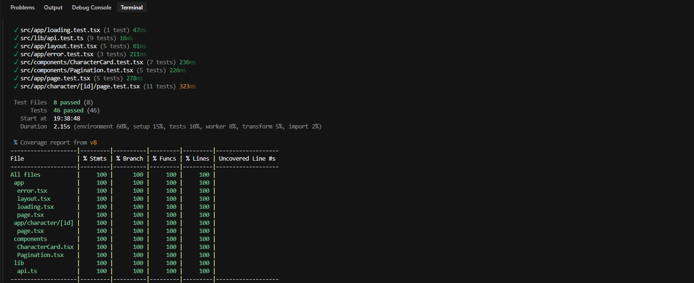

# Rick and Morty Explorer 🧪

Una aplicación web moderna para explorar el universo de Rick and Morty, construida con Next.js 15, React 19 y Tailwind CSS v4.

## 🚀 Características

- **Exploración de Personajes**: Navega a través de todos los personajes de la serie con una interfaz de cuadrícula responsive.
- **Detalle de Personaje**: Información detallada de cada personaje, incluyendo origen, ubicación y episodios.
- **Paginación**: Navegación fluida entre páginas de resultados.
- **Diseño Responsive**: Optimizado para móviles, tablets y escritorio.
- **Modo Oscuro**: Interfaz oscura por defecto con estética acorde a la serie.
- **Server-Side Rendering (SSR)**: Carga rápida y SEO optimizado gracias a Next.js App Router.

## 🛠️ Tecnologías

- **Framework**: [Next.js 15](https://nextjs.org/) (App Router)
- **Biblioteca UI**: [React 19](https://react.dev/)
- **Estilos**: [Tailwind CSS v4](https://tailwindcss.com/)
- **API**: [The Rick and Morty API](https://rickandmortyapi.com/)
- **Tipado**: TypeScript

## 📦 Instalación y Ejecución Local

1.  **Clonar el repositorio** (o descargar el código):
    ```bash
    git clone <tu-repositorio>
    cd my-app
    ```

2.  **Instalar dependencias**:
    ```bash
    npm install
    # o
    pnpm install
    # o
    yarn install
    ```

3.  **Ejecutar el servidor de desarrollo**:
    ```bash
    npm run dev
    # o
    pnpm dev
    # o
    yarn dev
    ```

4.  Abrir [http://localhost:3000](http://localhost:3000) en tu navegador.

## 🧪 Pruebas Unitarias

Las pruebas usan [Vitest](https://vitest.dev/) con [React Testing Library](https://testing-library.com/docs/react-testing-library/intro/) sobre `jsdom`, y la cobertura se mide con el proveedor `v8`.

### Comandos

```bash
pnpm test          # modo watch
pnpm test:run      # ejecución única
pnpm coverage      # vitest run --coverage (reporte en consola + HTML en coverage/)
```

La configuración está en [`vitest.config.ts`](vitest.config.ts). Exige un **mínimo de 80 %** en statements, branches, functions y lines (`coverage.thresholds`), y el comando falla si alguna métrica queda por debajo.

### Estructura

Cada archivo de prueba vive junto al código que prueba (`*.test.ts(x)`):

| Archivo | Qué se prueba |
|---|---|
| `src/lib/api.test.ts` | Cliente de la API: URLs, página por defecto, manejo de errores y normalización de `getEpisodes` (objeto único → array, lista vacía sin petición). `fetch` está mockeado. |
| `src/components/CharacterCard.test.tsx` | Datos del personaje, imagen, enlace al detalle y color del indicador según el estado. |
| `src/components/Pagination.test.tsx` | Enlaces anterior/siguiente habilitados o deshabilitados en la primera página, una intermedia, la última y una página única. |
| `src/app/page.test.tsx` | Server Component de inicio: lectura de `?page=`, una tarjeta por personaje y propagación de errores. |
| `src/app/character/[id]/page.test.tsx` | Detalle: extracción de IDs de episodios, formato de fecha, `type` vacío → "Unknown", estado y episodios. |
| `src/app/error.test.tsx` | Mensaje de error, log en consola y botón "Try again" → `reset()`. |
| `src/app/loading.test.tsx` | Skeletons de carga. |
| `src/app/layout.test.tsx` | Metadata, fuentes, header, `children` y footer. |

Los datos de prueba compartidos están en `src/test/fixtures.ts`. En [`vitest.setup.tsx`](vitest.setup.tsx) se mockea `next/image` globalmente.

### Reporte de cobertura

El reporte se incluye en el repositorio:

- HTML: [`coverage/index.html`](coverage/index.html)
- Resumen de consola: [`coverage/coverage-summary.txt`](coverage/coverage-summary.txt)

| Métrica | Cobertura |
|---|---|
| Statements | 100 % (46/46) |
| Branches | 100 % (29/29) |
| Functions | 100 % (16/16) |
| Lines | 100 % (45/45) |

Captura del resumen en consola:



## 🚀 Despliegue

La forma más sencilla de desplegar esta aplicación es utilizando [Vercel](https://vercel.com/new).

1.  Sube tu código a un repositorio de GitHub, GitLab o Bitbucket.
2.  Importa el proyecto en Vercel.
3.  Vercel detectará automáticamente que es un proyecto Next.js.
4.  Haz clic en **Deploy**.

## 📂 Estructura del Proyecto

- `src/app`: Rutas de la aplicación (App Router).
  - `page.tsx`: Página principal (lista de personajes).
  - `character/[id]/page.tsx`: Página de detalle de personaje.
  - `loading.tsx` / `error.tsx`: Estados de carga y error.
  - `layout.tsx`: Layout principal con Header y Footer.
- `src/components`: Componentes reutilizables (`CharacterCard`, `Pagination`).
- `src/lib`: Lógica de cliente API (`api.ts`).
- `src/types`: Definiciones de tipos TypeScript (`rickandmorty.ts`).

## ✅ Requisitos Cumplidos

- [x] Consumo de API de Personajes.
- [x] Vista de cuadrícula con imagen, nombre, estado y especie.
- [x] Paginación.
- [x] Vista de detalle con información completa.
- [x] Lista de episodios en la vista de detalle.
- [x] Enrutamiento cliente-servidor (Next.js).
- [x] Diseño Responsive.
- [x] Loading states y manejo de errores.
